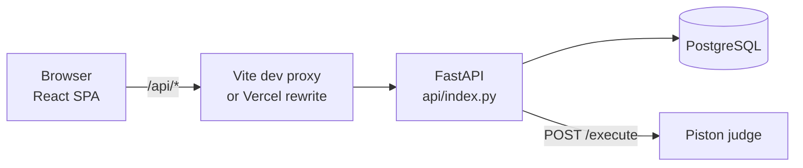

# CodeArena / ZAP — Codebase Reference

A competitive-programming contest platform. **React 19 + Vite + TypeScript** frontend, **FastAPI + SQLAlchemy + PostgreSQL** backend, with code execution delegated to a self-hosted **Piston** judge. Deployed as a single Vercel project: the frontend as static assets, the backend as one Python serverless function.

> This document describes every tracked file and folder. Generated/vendored directories (`node_modules`, `dist`, `.venv`, `.postgres`) are described as a group at the end.

---

## Table of contents

- [Request flow (how it fits together)](#request-flow)
- [Root — build & tooling config](#root--build--tooling-config)
- [Root — environment & deployment](#root--environment--deployment)
- [`api/` — FastAPI backend](#api--fastapi-backend)
- [`api/routers/` — HTTP route modules](#apirouters--http-route-modules)
- [`src/` — frontend entry & shared code](#src--frontend-entry--shared-code)
- [`src/pages/` — participant-facing pages](#srcpages--participant-facing-pages)
- [`src/pages/admin/` — admin pages](#srcpagesadmin--admin-pages)
- [`src/components/` — shared components](#srccomponents--shared-components)
- [`problems/` — importable problem bank](#problems--importable-problem-bank)
- [Stale files](#stale-files)
- [Generated / ignored directories](#generated--ignored-directories)

---

## Request flow



- The frontend always calls relative paths under `/api`. In development, [vite.config.ts](vite.config.ts) proxies these to `127.0.0.1:8000`; in production, the `rewrites` rule in [vercel.json](vercel.json) routes them to the Python function.
- FastAPI routes are declared with their **full** `/api/...` path (there is no router prefix stripping), so the same URL works in both environments.
- All code execution is outbound HTTP to Piston. The backend never runs untrusted code itself.

---

## Root — build & tooling config

| File | Purpose |
|---|---|
| [index.html](index.html) | Vite HTML entry point. Loads `src/main.tsx` as a module; sets the page title "ZAP — Online Coding Platform". |
| [package.json](package.json) | Frontend manifest. Scripts: `dev` (Vite server), `build` (`tsc -b && vite build`), `typecheck` (`tsc --noEmit`), `lint`, `preview`. Key deps: React 19, React Router, TanStack Query, `@monaco-editor/react`, Radix UI primitives, Tailwind, Lucide icons, Sonner toasts. |
| [vite.config.ts](vite.config.ts) | Vite config: React plugin, `@` → `src` alias, **dev proxy `/api` → `http://127.0.0.1:8000`**, and `vite-plugin-singlefile` which inlines all JS/CSS into one `dist/index.html`. |
| [tsconfig.json](tsconfig.json) | Root TS config; project references to the app and node configs, plus the `@/*` path alias. |
| [tsconfig.app.json](tsconfig.app.json) | TS config for `src/` — ES2022, React JSX, `strict`, `noUnusedLocals`/`noUnusedParameters`. |
| [tsconfig.node.json](tsconfig.node.json) | TS config for build-time files (`vite.config.ts`). |
| [tailwind.config.js](tailwind.config.js) | Tailwind setup: class-based dark mode, content globs over `src/`, theme colours wired to the CSS variables defined in `src/index.css`. |
| [postcss.config.js](postcss.config.js) | Runs Tailwind + Autoprefixer. |
| [eslint.config.js](eslint.config.js) | ESLint flat config (JS, TypeScript, React Hooks, React Refresh). Ignores `dist` and `src/components/ui`. |
| [components.json](components.json) | shadcn/ui CLI config (new-york style, TSX, Lucide icons, path aliases). Used when generating new `ui/` components. |
| [bundle-artifact.sh](bundle-artifact.sh) | Standalone helper that builds the app and copies the single-file `dist/index.html` into `render/`. **Not part of the Vercel build** — it is a separate artifact workflow and calls `pnpm`, unlike the rest of the repo. |
| [package-lock.json](package-lock.json) / [bun.lock](bun.lock) | Two lockfiles from two package managers. `npm` is what the project is currently driven with; `bun.lock` is a leftover. Keeping both risks dependency drift — pick one. |

---

## Root — environment & deployment

| File | Purpose |
|---|---|
| [vercel.json](vercel.json) | Deployment config. Builds the Vite frontend to `dist`, registers `api/index.py` as a serverless function (`maxDuration` 30s), rewrites `/api/(.*)` to it, and uses `excludeFiles` to keep venvs/DB/artifacts out of the function bundle. |
| [.vercelignore](.vercelignore) | Excludes local venvs, the local Postgres cluster, `render/`, `node_modules`, and **`.env` files** from upload. Critical because this folder is not a git repo, so CLI deploys have no `.gitignore` to fall back on. |
| [.python-version](.python-version) | Pins the Vercel Python runtime to 3.12. |
| `.env` | **Untracked.** The single source of configuration: `DATABASE_URL`, `JWT_SECRET`, `PISTON_ENDPOINTS`, `PISTON_API_KEY`, `CORS_ORIGINS`, `ADMIN_EMAIL`, `ADMIN_PASSWORD`, plus `VITE_API_BASE_URL` for the frontend. In production these belong in Vercel Project Settings instead. |
| `.env.example` | Committed template for the above, documenting which vars are backend vs. frontend. |
| [.gitignore](.gitignore) | Ignores `node_modules`, `dist`, venvs, `.postgres/`, `render/`, and `.env` files. |
| [.vscode/settings.json](.vscode/settings.json) | Editor workspace settings — explorer/tree preferences and search/file exclusions for `__pycache__`, `.venv`, etc. |
| `.vscode/mcp.json` | MCP server definitions for editor tooling. Not used by the application. |
| [README.md](README.md) | **Still the stock Vite + React template README.** Contains no project-specific information. |
| [context.md](context.md) | A 64-line design/architecture note (design tokens, route list, key decisions). **Partly stale** — it describes mock data in `src/data/mock.ts` and says Monaco is unavailable, both of which are no longer true. |

---

## `api/` — FastAPI backend

Modules use **flat imports** (`from database import ...`, `import models`). `index.py` inserts its own directory onto `sys.path` so this works both under `uvicorn --app-dir api` locally and on Vercel, where the working directory is the project root.

| File | Purpose |
|---|---|
| [api/index.py](api/index.py) | Application entry point and the Vercel function handler (exports `app`). Loads `.env` **before** importing modules that read env vars at import time, configures CORS, applies a small in-process rate limiter to `/api/code/run` and `/api/submissions`, creates tables on startup, bootstraps the admin user from `ADMIN_EMAIL`/`ADMIN_PASSWORD`, and mounts every router. |
| [api/database.py](api/database.py) | SQLAlchemy engine/session setup. Normalises `postgres://` and `postgresql://` URLs to `postgresql+psycopg://` (so Neon/Vercel connection strings work unchanged), defines the declarative `Base`, and exposes the `get_db()` request dependency. Engine is `None` when `DATABASE_URL` is unset. |
| [api/models.py](api/models.py) | All ORM tables: `User`, `Problem`, `TestCase`, `Contest`, `ContestProblem`, `ContestModerator`, `ContestParticipant`, `CodeDraft`, `Submission`, `SubmissionTestResult`, `ExecutionLog`, `ContestActivityLog`. IDs are 32-char hex strings generated in Python. |
| [api/schemas.py](api/schemas.py) | Pydantic request/response models. Uses **camelCase** field names to match the frontend, in contrast to the snake_case ORM columns. Includes validation such as "endTime must be after startTime". |
| [api/serializers.py](api/serializers.py) | Converts ORM objects into the camelCase JSON shapes the frontend expects. Also enforces test-case privacy: hidden cases return only `{id, name, hidden, marks}` unless `include_hidden=True`. |
| [api/security.py](api/security.py) | Password hashing (`passlib` + bcrypt) and JWT issue/decode (`PyJWT`, HS256, 12-hour expiry). Raises if `JWT_SECRET` is unset rather than signing with an empty key. |
| [api/deps.py](api/deps.py) | FastAPI dependencies: `get_current_user`, `get_optional_user`, `require_admin`. These are the authorization boundary for every protected route. |
| [api/scoring.py](api/scoring.py) | Judging orchestration. `run_public()` powers the "Run" button (custom stdin, unscored); `judge_submission()` runs every test case sequentially, compares normalised output, and aggregates marks; `compute_problem_score()` implements full vs. partial scoring. Aborts the run and forces score 0 on `COMPILATION_ERROR`/`JUDGE_UNAVAILABLE`. |
| [api/piston_service.py](api/piston_service.py) | HTTP client for the Piston judge. Round-robins across `PISTON_ENDPOINTS` with failover, retries the whole ring up to 3 times with backoff, maps language → source filename (`java` → `Main.java`), and translates Piston's response into a verdict status. |
| [api/problem_import.py](api/problem_import.py) | Parses a bulk-import ZIP into problem dictionaries. Handles both layouts (with/without a wrapping root folder), accepts camelCase or snake_case keys, natural-sorts `tc1…tc10`, and derives languages from `boilerplate/` filenames. Security limits: rejects zip-slip paths, caps archive size (20 MB), uncompressed size (100 MB), entry count, and per-file size. |
| [api/seed.py](api/seed.py) | Standalone test-data seeder (not imported by the app). Creates 5 users, loads the `problems/` bank through the real ZIP importer, and builds three contests — live, upcoming and past — with participants and synthetic submissions so leaderboards and profiles have realistic data. Idempotent: matches on email/slug and updates rather than duplicating. `--reset` removes only its own rows; `--no-submissions` skips the fake submissions. |
| [api/rate_limit.py](api/rate_limit.py) | Fixed-window request limiter backed by the `rate_limits` table, so the count is shared across serverless instances instead of living in one process's memory. Identities are SHA-256 hashed before storage, expired rows are swept probabilistically, and it degrades to an in-memory limiter if the database is unavailable. Tunable via `RATE_LIMIT_REQUESTS` and `RATE_LIMIT_WINDOW_SECONDS`. |
| [api/requirements.txt](api/requirements.txt) | Backend dependencies: FastAPI, Uvicorn, Pydantic, SQLAlchemy 2, psycopg 3, PyJWT, passlib + bcrypt (pinned to 4.0.1 — 5.x breaks passlib), httpx, openpyxl, email-validator, python-multipart. |

---

## `api/routers/` — HTTP route modules

| File | Purpose |
|---|---|
| [api/routers/__init__.py](api/routers/__init__.py) | Empty; marks the directory as a package. |
| [api/routers/auth.py](api/routers/auth.py) | `POST /api/auth/register`, `POST /api/auth/login`, `GET /api/auth/me`. Registration always assigns the `user` role — admins are created only via the startup bootstrap or a direct DB change. |
| [api/routers/problems.py](api/routers/problems.py) | Public problem listing/detail, admin CRUD, server-side **problem search** (`GET /api/admin/problems/search`, with LIKE wildcards escaped), and the **bulk ZIP import** endpoint (`POST /api/admin/problems/import-zip`) supporting a `dry_run` preview. Delete is a soft delete (`status = archived`). |
| [api/routers/contests.py](api/routers/contests.py) | The largest router. Public contest list/detail; participant lifecycle (`start`, `session`, `finish`); contest problems; code-draft save/load; personal submissions; leaderboard; and admin CRUD, publish, participants and results. `compute_status()` derives `scheduled`/`active`/`completed` from the clock, and `start` returns 403 outside the contest window. Delete is a soft delete (`status = cancelled`). |
| [api/routers/submissions.py](api/routers/submissions.py) | `POST /api/code/run` (unscored execution) and `POST /api/submissions` (full judge run). Enforces language support, contest participation, per-problem submit cooldown, and marks submissions landing after `contest.end_time` as `is_late` — those are stored but scored 0 and never update the participant's leaderboard totals. |
| [api/routers/profile.py](api/routers/profile.py) | `GET /api/me/profile`. Aggregates the signed-in user's contests, per-contest score/solved counts, per-problem breakdown, and leaderboard rank, excluding late submissions. |
| [api/routers/admin.py](api/routers/admin.py) | Admin reporting: platform statistics, filterable submission list, execution logs, user directory, and contest results **export to CSV/XLSX**. All routes require `require_admin`, so the export must be fetched with the auth header (not a plain link). |
| [api/routers/public.py](api/routers/public.py) | `GET /api/public/home` — one unauthenticated call returning the landing-page snapshot (upcoming/live contests, sample problems, headline counts). |

---

## `src/` — frontend entry & shared code

| File | Purpose |
|---|---|
| [src/main.tsx](src/main.tsx) | React entry point. Mounts `<App/>` inside `StrictMode` and the TanStack Query provider. |
| [src/App.tsx](src/App.tsx) | Router. Uses `HashRouter` (so deep links work on static hosting without rewrites) and defines the `RequireAuth` / `RequireAdmin` route guards. |
| [src/index.css](src/index.css) | The design system: light/dark CSS custom properties, fonts (Plus Jakarta Sans, JetBrains Mono), and utility classes used throughout (`card-glow`, `verdict-*`, `diff-*`, `sidebar-item`). |
| [src/App.css](src/App.css) | Effectively empty; all styling lives in `index.css`. |
| [src/lib/api.ts](src/lib/api.ts) | The single HTTP client. Attaches the bearer token, unwraps errors into `ApiError`, clears the token on 401, and provides `get/post/put/delete`, `upload` (multipart), and `download` (authenticated blob download). Base URL is `VITE_API_BASE_URL` or `/api`. |
| [src/lib/utils.ts](src/lib/utils.ts) | `cn()` — merges Tailwind classes via `clsx` + `tailwind-merge`. |
| [src/types/index.ts](src/types/index.ts) | Shared TypeScript interfaces mirroring the API payloads (`Problem`, `TestCase`, `Contest`, `ContestProblem`, `ContestModerator`, `Submission`, `LeaderboardEntry`, …). |
| [src/store/auth.ts](src/store/auth.ts) | Minimal pub/sub auth store (no state library). Persists the JWT in `localStorage`, restores the session via `/auth/me`, and exposes `useAuth()` with `login`/`register`/`logout`. |
| [src/store/theme.ts](src/store/theme.ts) | Pub/sub dark-mode store. Persists to `localStorage` under `zap-theme` and toggles the `dark` class on `<html>`. |
| [src/hooks/use-mobile.tsx](src/hooks/use-mobile.tsx) | `useIsMobile()` — media-query hook for the ≤767px breakpoint, used by the sidebar. |
| `src/assets/` | Empty. The template SVGs it held were unused and have been removed. |
| [public/vite.svg](public/vite.svg) | Favicon referenced by `index.html`. |

---

## `src/pages/` — participant-facing pages

| File | Purpose |
|---|---|
| [src/pages/HomePage.tsx](src/pages/HomePage.tsx) | Public landing page: hero, platform stats, live/upcoming contests and featured problems, driven by `/api/public/home`. |
| [src/pages/LoginPage.tsx](src/pages/LoginPage.tsx) | Split-layout sign-in form with password visibility toggle and redirect-back-to-referrer. |
| [src/pages/RegisterPage.tsx](src/pages/RegisterPage.tsx) | Self-service registration (min 8-character password). New accounts always get the `user` role. |
| [src/pages/ContestEntryPage.tsx](src/pages/ContestEntryPage.tsx) | Pre-contest briefing: description, problem summary, admin-authored **instructions**, and the Start Contest button that begins the participant's timer. |
| [src/pages/ContestWorkspacePage.tsx](src/pages/ContestWorkspacePage.tsx) | The contest IDE. Monaco editor with per-language boilerplate, resizable panels for statement/submissions/leaderboard, custom stdin, Run and Submit, countdown timer, fullscreen mode, and periodic refetching of submissions and leaderboard. |
| [src/pages/ContestResultPage.tsx](src/pages/ContestResultPage.tsx) | Post-contest summary: final score, rank, problems solved, and a per-problem results table. |
| [src/pages/ProfilePage.tsx](src/pages/ProfilePage.tsx) | Candidate profile at `/profile`. Shows lifetime stats (contests, problems solved, total score, acceptance rate) and, per contest, the rank, score, and which problems were solved/attempted. |
| [src/pages/NotFound.tsx](src/pages/NotFound.tsx) | 404 card with a link home. |

## `src/pages/admin/` — admin pages

All are wrapped in `AdminLayout` and guarded by `RequireAdmin`.

| File | Purpose |
|---|---|
| [src/pages/admin/AdminDashboard.tsx](src/pages/admin/AdminDashboard.tsx) | Overview: headline counts plus recent submissions, contests and execution logs. |
| [src/pages/admin/AdminProblems.tsx](src/pages/admin/AdminProblems.tsx) | Problem bank management. Table with filters; create/edit dialog covering details, test cases (public/hidden + marks) and per-language boilerplate; archive with confirmation; and the **bulk ZIP import** dialog with a validated dry-run preview. |
| [src/pages/admin/AdminContests.tsx](src/pages/admin/AdminContests.tsx) | Contest management. Shared create/edit form with title, description, instructions, start/end datetime pickers, attempt duration, scoring mode, moderator selection, a debounced server-backed **problem picker**, and reorderable attached problems with per-problem scores. Publish, copy URL, and delete (with confirmation). |
| [src/pages/admin/AdminContestDetail.tsx](src/pages/admin/AdminContestDetail.tsx) | Single-contest report: participation summary, leaderboard, submissions, and authenticated CSV/XLSX export. |
| [src/pages/admin/AdminParticipants.tsx](src/pages/admin/AdminParticipants.tsx) | Participants across contests, with a per-participant detail dialog showing their submissions. |
| [src/pages/admin/AdminSubmissions.tsx](src/pages/admin/AdminSubmissions.tsx) | Global submission browser with filters and a source-code viewer. |
| [src/pages/admin/AdminLogs.tsx](src/pages/admin/AdminLogs.tsx) | Execution audit trail with status/language filters and aggregate timings. |
| [src/pages/admin/AdminUsers.tsx](src/pages/admin/AdminUsers.tsx) | Read-only user directory (name, email, role, joined date). |

---

## `src/components/` — shared components

**In use:**

| File | Purpose |
|---|---|
| [src/components/AdminLayout.tsx](src/components/AdminLayout.tsx) | Sidebar shell for every admin page: navigation, collapsible mobile drawer, theme toggle, and user menu. |
| [src/components/Navbar.tsx](src/components/Navbar.tsx) | Top bar for public/participant pages: brand link, theme toggle, and the user dropdown (Admin Dashboard / Profile / Logout). |
| [src/components/ContestTimer.tsx](src/components/ContestTimer.tsx) | HH:MM:SS countdown that turns urgent under 5 minutes and fires `onExpire()`. |
| [src/components/VerdictBadge.tsx](src/components/VerdictBadge.tsx) | Maps a submission status to a coloured chip. |
| [src/components/DifficultyBadge.tsx](src/components/DifficultyBadge.tsx) | Easy/Medium/Hard chip. |
| [src/components/ThemeToggle.tsx](src/components/ThemeToggle.tsx) | Dark/light switch bound to the theme store. |
| `src/components/ui/` | **53 shadcn/ui primitives** (Radix + Tailwind): dialog, alert-dialog, select, table, tabs, checkbox, command, popover, resizable, sonner, sidebar, etc. Generated by the shadcn CLI and excluded from linting. Not all 53 are used — they were added as a set. |

Every other component in this directory is imported somewhere; the leftover template components that used to sit here have been deleted.

---

## `problems/` — importable problem bank

Sample content in the exact layout the ZIP importer expects. **Not read at runtime** — it is zipped and uploaded through the admin UI.

```
problems/<slug>/
├── problem.json          metadata: title, difficulty, io format, constraints,
│                         examples, tags, languages, limits, maxScore
├── statement.md          full markdown problem statement
├── boilerplate/          c.c · cpp.cpp · java.java · python.py (stdin/stdout
│                         wiring done, solution body left as TODO)
└── testcases/            tc1..tc4.json — { name, input, expected_output,
                          hidden, marks, order }
```

Included problems: `two-sum`, `reverse-string`, `fizz-buzz` — each with 4 test cases (2 visible, 2 hidden) totalling 100 marks.

> Note: `java.java` must be materialised as `Main.java` at execution time, since the boilerplate declares `public class Main`. `piston_service.py` already maps the language to that filename.

---

## Stale files

The dead template components, unused assets and junk artifacts that used to live here were removed on 2026-09-03: `HelloWorld.tsx`, `index.ts`, `login-form.tsx`, `app-sidebar.tsx`, `nav-main.tsx`, `nav-user.tsx`, `team-switcher.tsx`, the three `src/assets/*.svg` files, `src/data/`, `api/pd.txt`, both `._.DS_Store` files, `render/`, and the stray `.venv/` and `api/venv/` virtualenvs. Typecheck and production build both pass without them.

What remains questionable:

| Path | Status |
|---|---|
| [README.md](README.md) | Still the stock Vite template \u2014 no project content. Worth replacing with real setup instructions. |
| [context.md](context.md) | Design notes that have drifted from reality (references mock fixtures that no longer exist; claims Monaco is unavailable although it is a dependency). |
| [bun.lock](bun.lock) + [package-lock.json](package-lock.json) | Two package managers' lockfiles coexist. The project is driven with npm; keeping both risks dependency drift. |
| [bundle-artifact.sh](bundle-artifact.sh) | The only consumer of `render/`, which no longer exists. Unused by Vercel and invokes `pnpm`. |

---

## Generated / ignored directories

Excluded from git and from Vercel uploads; recreate them locally as needed.

| Path | What it is |
|---|---|
| `node_modules/` | npm dependencies (~314 MB). `npm install`. |
| `dist/` | Vite production build \u2014 a single inlined `index.html`. `npm run build`. |
| `api/.venv/` | Backend virtualenv (~117 MB). `python -m venv api/.venv` + `pip install -r api/requirements.txt`. |
| `.postgres/` | Local PostgreSQL 18 server binaries and the `data/` cluster (~220 MB), extracted from the `postgresql-binaries` wheel so Postgres can run without admin rights or Docker. |
| `.playwright-mcp/` | Scratch output from browser tooling. |

---

## Conventions worth knowing

1. **Naming boundary.** The database and Python internals use `snake_case`; every JSON payload crossing the API uses `camelCase`. `serializers.py` and `schemas.py` are where the translation happens — keep it there.
2. **Soft deletes.** Problems become `archived`, contests become `cancelled`. Rows are never removed, so historical results stay intact.
3. **Parent before child.** When creating a `Contest` or `Problem` with child rows, the parent must be `db.add()`-ed and `db.flush()`-ed first — its primary key is generated by a Python-side default that only runs at flush time.
4. **Schema changes need manual SQL.** Startup calls `Base.metadata.create_all`, which creates missing *tables* but never adds *columns* to existing ones. New columns require an explicit `ALTER TABLE` against each environment.
5. **Late submissions.** Anything landing after `contest.end_time` is persisted with `is_late = true` and score 0, and is excluded from participant totals, the leaderboard, and profile statistics.

---

## Known gaps

- **Moderators are cosmetic.** `ContestModerator` rows are stored and displayed, but every admin route still checks `require_admin`, so being a moderator grants no additional access.
- **Cold-start DDL.** `create_all` plus the admin bootstrap run on every cold start, adding latency on serverless.
- **`README.md` and `context.md` are out of date** relative to this document.
